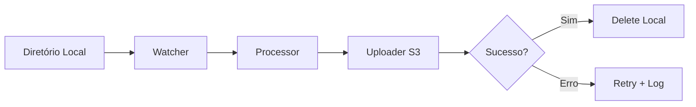

<div align="center">

<!-- Banner Hero -->


<!-- Badges animados -->
[](https://aws.amazon.com/s3/)
[](https://www.python.org/)
[](LICENSE)

</div>

---

## 📋 Sobre o Projeto

</div>

Este projeto implementa um **sistema automatizado de backup de arquivos** utilizando Python e o serviço de armazenamento em nuvem **Amazon S3**. A aplicação é responsável por monitorar uma pasta local, enviar automaticamente os arquivos para um bucket S3 na AWS e, após a confirmação do upload bem-sucedido, remover os arquivos do armazenamento local.

A solução foi projetada para **garantir segurança, escalabilidade e organização**, permitindo que arquivos importantes sejam armazenados de forma confiável na nuvem, reduzindo o risco de perda de dados e liberando espaço no dispositivo local.

### 🎯 Objetivos

- ✅ Automatizar o processo de backup de arquivos locais
- ✅ Enviar arquivos de forma segura para um bucket **Amazon S3**
- ✅ Garantir a integridade dos dados após o upload
- ✅ Liberar espaço de armazenamento no ambiente local
- ✅ Criar uma solução simples e eficiente de **backup em nuvem com Python**

## 🧱 Arquitetura



---

## 🏗️ Estrutura do Projeto

```bash
python-s3-backup/
│
├── app/
│   ├── core/
│   ├── services/
│   ├── utils/
│   ├── handlers/
│   └── main.py
│
├── logs/
├── tests/
├── .env
├── requirements.txt
├── Dockerfile
└── README.md
```

---

## ⚙️ Tecnologias

* Python 3.8+
* boto3
* Docker
* GitHub Actions
* logging
* python-dotenv

---

## 🔑 Configuração

Crie um arquivo `.env`:

```env
AWS_ACCESS_KEY_ID=your_key
AWS_SECRET_ACCESS_KEY=your_secret
AWS_REGION=us-east-1
BUCKET_NAME=backup-bucket
LOCAL_FOLDER=./data
LOG_LEVEL=INFO
```

---

## 🚀 Execução Local

```bash
python -m venv venv
```

```bash
venv\Scripts\activate
```

```bash
pip install -r requirements.txt
```

```bash
python app/main.py
```

---

## 🐳 Execução com Docker

```bash
docker build -t s3-backup .
docker run --env-file .env s3-backup
```

---

## 🔁 CI/CD (GitHub Actions)

```yaml
name: CI

on: [push]

jobs:
  build:
    runs-on: ubuntu-latest

    steps:
      - uses: actions/checkout@v3

      - name: Setup Python
        uses: actions/setup-python@v4
        with:
          python-version: 3.10

      - run: pip install -r requirements.txt
      - run: pytest
```

---

## 📊 Observabilidade

* Logs estruturados
* Níveis: INFO, WARNING, ERROR
* Integração futura com Grafana / ELK

---

## 🔒 Segurança

* Uso de variáveis de ambiente
* Não expõe credenciais
* Compatível com IAM Roles

---

## ⚡ Funcionalidades

* ✔️ Upload automático para S3
* ✔️ Exclusão pós-upload
* ✔️ Retry em falhas
* ✔️ Logs detalhados
* ✔️ Execução contínua
* ✔️ Estrutura modular

---

## 🧠 Melhorias Futuras

* Dashboard de métricas
* Notificações (Telegram / Slack)
* Compressão de arquivos
* Versionamento S3
* Paralelismo
* API REST

---

## 🧪 Testes

```bash
pytest tests/
```

---

## 📈 Roadmap

* [x] Upload básico S3
* [x] Estrutura modular
* [ ] Monitoramento em tempo real
* [ ] Interface web
* [ ] Deploy em cloud

---

## 🤝 Contribuição

```bash
git checkout -b feature/nova-feature
git commit -m "feat: nova feature"
git push origin feature/nova-feature
```

---

## 📄 Licença

MIT License

---

## 👨‍💻 Autor

**Giovanni Micheletti**

Foco em Engenharia de Dados | Cloud | Automação

---

## ⭐ Apoie o projeto

Se esse projeto te ajudou:

* Deixe uma estrela
* Compartilhe
* Contribua

---

<div align="center">

🔥 Automação hoje. Escala amanhã.

</div>
